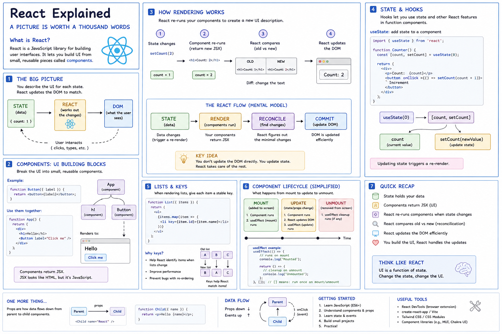
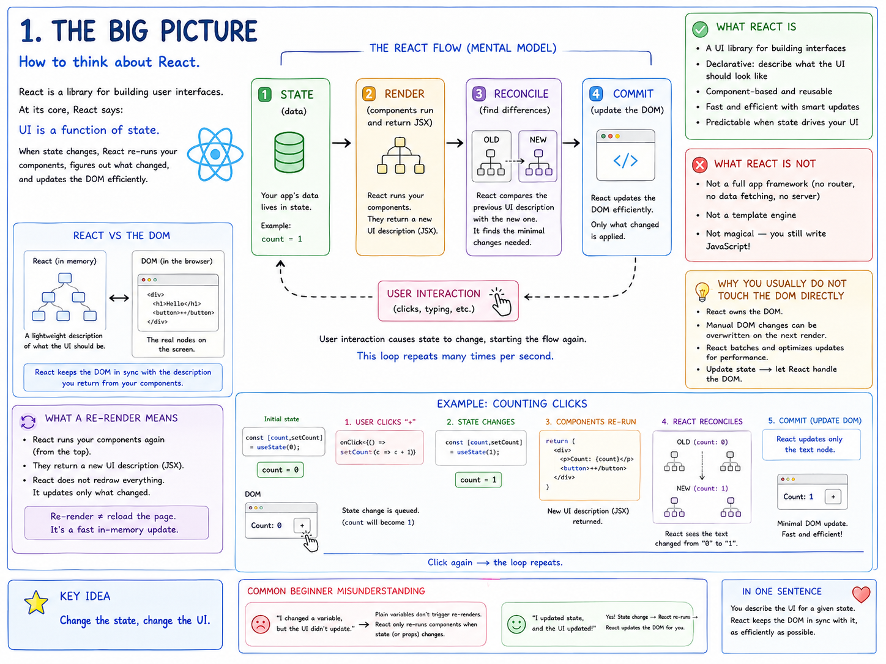
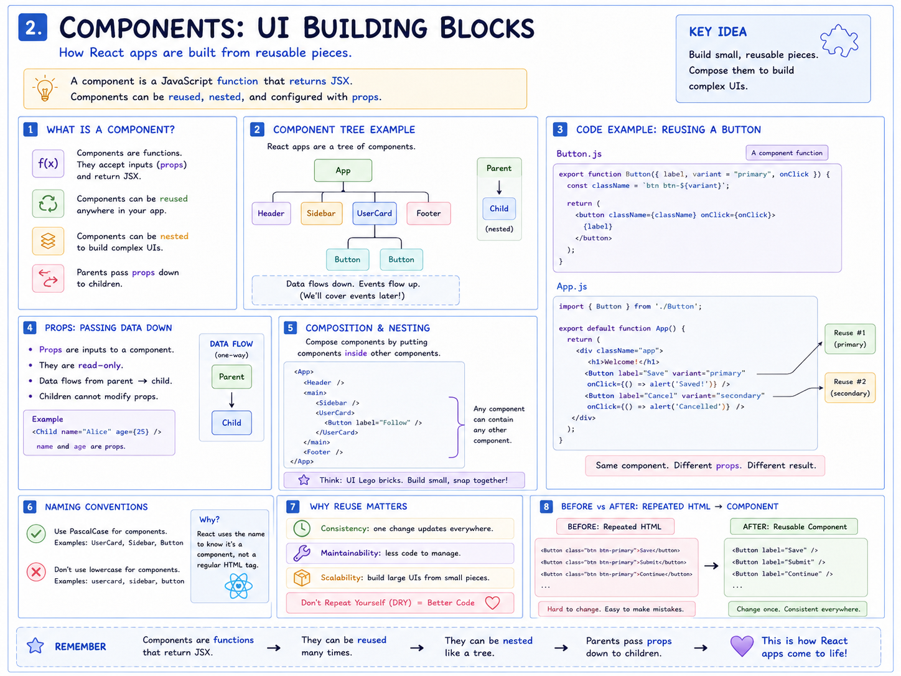
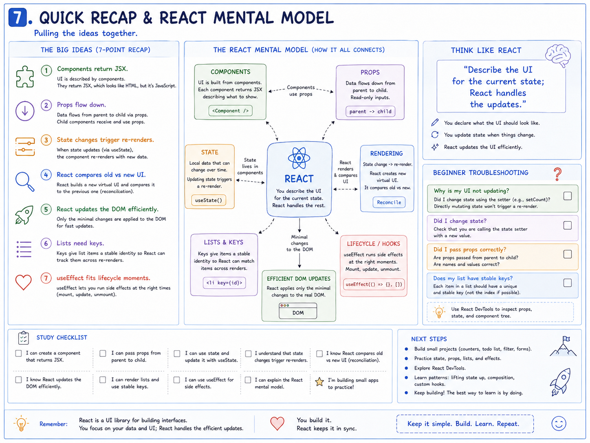

# React From Cradle to Grave

## A Ground-Up Mental Model of JavaScript, the Browser, the DOM, and React

> **Goal:** Understand not just *how to write React*, but **why React exists, what problem it solves, what parts are still plain JavaScript, how React interacts with the browser, and what happens from the moment a user does something until the screen changes.**



---

## How to Use This Lesson

This guide is intentionally broader than a normal React tutorial.

React becomes much easier when you already understand the things underneath it:

- HTML
- CSS
- JavaScript
- arrays and objects
- functions
- callbacks
- events
- the DOM
- browser memory
- modules
- `map()`
- `filter()`
- destructuring
- spread syntax
- asynchronous code

The lesson therefore starts **before React**, builds the browser mental model, then introduces React as a tool that sits on top of those fundamentals.

The main question we will repeatedly ask is:

> **What is plain JavaScript, what belongs to the browser, and what does React add?**

---

# 1. The Web Before React

Before we talk about React, we need to understand what a normal web page already has.

A basic web application is built from three major technologies:

```text
HTML
  ↓
structure

CSS
  ↓
presentation

JavaScript
  ↓
behavior
```

Think of them as different responsibilities.

## HTML — What Exists?

HTML describes the structure of the page.

```html
<h1>Hello</h1>

<button id="countButton">
  Click Me
</button>

<p id="countDisplay">0</p>
```

HTML answers questions like:

- Is there a heading?
- Is there a button?
- Is there a paragraph?
- What is inside each element?

---

## CSS — What Does It Look Like?

CSS controls presentation.

```css
button {
  padding: 10px;
  border-radius: 6px;
}
```

CSS answers questions like:

- What color is this?
- How large is this?
- Where is this placed?
- How much spacing should it have?

---

## JavaScript — What Does It Do?

JavaScript adds behavior.

```js
const button = document.getElementById("countButton");
const display = document.getElementById("countDisplay");

let count = 0;

button.addEventListener("click", () => {
  count++;
  display.textContent = count;
});
```

Now the page reacts to the user.

---

# 2. The Browser Builds the DOM

One of the most important ideas for understanding React is that your HTML source file and the page currently running in the browser are **not the same thing**.

The browser reads the HTML file and constructs an in-memory object representation called the **Document Object Model**, or DOM.

```text
HTML file
   ↓
browser parses HTML
   ↓
DOM tree exists in memory
   ↓
browser displays the page
```

For example:

```html
<body>
  <h1>Hello</h1>
  <button>Click</button>
</body>
```

becomes conceptually something like:

```text
Document
└── html
    └── body
        ├── h1
        │   └── "Hello"
        └── button
            └── "Click"
```

JavaScript can access and change these DOM objects.

---

# 3. The Microsoft Word Analogy

A useful way to understand the DOM is to compare the browser to Microsoft Word.

Imagine you have this file on disk:

```text
report.docx
```

You open it in Word.

Word loads the document into memory so you can work on it.

Now imagine you type:

```text
Original:
Hello

You edit it to:
Hello World
```

While Word is open, your changes exist in the working copy in memory.

If you close Word **without saving**, those changes disappear.

The file on disk never changed.

The browser works similarly.

```text
HTML FILE ON DISK
≈
saved Word document

DOM IN BROWSER MEMORY
≈
Word document currently open

JavaScript changing DOM
≈
editing the open Word document

Refresh browser
≈
close without saving and reopen
```

This is why JavaScript can do:

```js
document.getElementById("message").textContent = "Hello World";
```

and the screen changes even though your actual `.html` source file was never rewritten.

---

# 4. Volatile Memory vs Persistent Storage

This distinction becomes extremely important in React.

Anything that exists only in the currently running page is generally **volatile**.

Close or refresh the page, and it may disappear.

Examples:

```text
JavaScript variables
DOM state
React state
temporary form values
temporary calculations
```

Persistent storage is different.

Examples include:

```text
database
localStorage
server
file
cloud storage
```

A useful mental model:

```text
RUNNING APPLICATION MEMORY
        ↓
temporary

PERSISTENT STORAGE
        ↓
survives application restart
```

React state is **not a database**.

---

# 5. Reading Data from the DOM with Vanilla JavaScript

Suppose we have:

```html
<input id="username" />
<button id="saveButton">Save</button>
```

Vanilla JavaScript might read the current value from the DOM:

```js
const input = document.getElementById("username");

console.log(input.value);
```

The browser has the current value.

JavaScript asks the DOM:

> "What is currently inside this input?"

This is a common vanilla JavaScript pattern.

---

# 6. A Simple Vanilla JavaScript Application

Consider a counter.

```html
<button id="increment">+</button>
<p id="count">0</p>
```

JavaScript:

```js
const button = document.getElementById("increment");
const display = document.getElementById("count");

let count = 0;

button.addEventListener("click", () => {
  count++;
  display.textContent = count;
});
```

There are four important pieces:

```text
DATA
count

EVENT
click

LOGIC
count++

DOM UPDATE
display.textContent = count
```

That pattern appears constantly in web development.

---

# 7. The Problem React Helps Solve

For a tiny page, manually updating the DOM is easy.

But imagine an application with:

```text
logged-in user
shopping cart
search results
notifications
modal windows
filters
form inputs
loading states
errors
permissions
API data
```

A single change may affect many places on the screen.

Suppose:

```js
user.name = "James";
```

Now perhaps we need to manually update:

```js
headerName.textContent = user.name;
profileName.textContent = user.name;
welcomeMessage.textContent = `Welcome, ${user.name}`;
```

As applications grow, the difficult part becomes keeping:

```text
DATA
and
UI
```

synchronized.

React approaches the problem differently.

---

# 8. The Central React Idea

Instead of saying:

> "Change this DOM node, then that DOM node, then this other DOM node..."

React encourages you to describe:

> **What should the UI look like for the current data?**

Conceptually:

```text
STATE / DATA
     ↓
COMPONENTS DESCRIBE UI
     ↓
REACT FIGURES OUT WHAT CHANGED
     ↓
DOM UPDATED
```

This gives us one of the most useful React mental models:

> **UI is a function of state.**

---



---

# 9. Vanilla DOM Thinking vs React Thinking

## Vanilla JavaScript

```text
data changes
    ↓
developer decides what DOM node to change
    ↓
developer changes DOM
```

Example:

```js
count++;

display.textContent = count;
```

---

## React

```text
state changes
    ↓
React runs component again
    ↓
component describes new UI
    ↓
React determines minimal DOM changes
```

Example:

```jsx
setCount(count + 1);
```

You update state.

React takes responsibility for synchronizing the rendered UI.

---

# 10. JavaScript You Should Know Before React

A large amount of "React syntax" is actually ordinary JavaScript.

Students often struggle with React because several JavaScript concepts arrive all at once.

---

## 10.1 `const` and `let`

React code uses `const` heavily.

```js
const name = "James";
```

Use `let` when the variable binding itself must change:

```js
let count = 0;
count++;
```

A `const` object can still contain changing data:

```js
const user = {
  name: "James"
};

user.name = "Abe";
```

`const` prevents reassignment of the variable itself.

---

## 10.2 Functions

Traditional function:

```js
function greet(name) {
  return `Hello ${name}`;
}
```

Arrow function:

```js
const greet = (name) => {
  return `Hello ${name}`;
};
```

React function components are still JavaScript functions:

```jsx
function Greeting() {
  return <h1>Hello</h1>;
}
```

---

## 10.3 Objects

```js
const user = {
  name: "Abe",
  age: 25
};
```

Access properties:

```js
user.name;
user.age;
```

React uses objects constantly for:

- props
- state
- API data
- configuration

---

## 10.4 Arrays

```js
const users = [
  "Abe",
  "Bond",
  "Carrie"
];
```

React frequently renders arrays of data.

---

## 10.5 Destructuring

Normal object access:

```js
const user = {
  name: "Abe",
  age: 25
};

const name = user.name;
const age = user.age;
```

Destructuring:

```js
const { name, age } = user;
```

This React code:

```jsx
function UserCard({ name, age }) {
```

is **JavaScript destructuring**, not special React syntax.

---

## 10.6 Array Destructuring

```js
const values = ["James", 40];

const [name, age] = values;
```

This becomes important when you see:

```js
const [count, setCount] = useState(0);
```

React's `useState()` returns an array-like pair.

JavaScript destructuring gives the two returned values convenient names.

---

## 10.7 Spread Syntax

Copy an object:

```js
const user = {
  name: "Abe",
  active: false
};

const updatedUser = {
  ...user,
  active: true
};
```

Result:

```js
{
  name: "Abe",
  active: true
}
```

This becomes extremely important for immutable state updates.

---

## 10.8 `map()`

JavaScript:

```js
const numbers = [1, 2, 3];

const doubled = numbers.map(number => number * 2);
```

React:

```jsx
users.map(user => (
  <UserCard user={user} />
));
```

`map()` is still a JavaScript array method.

React simply uses the returned elements as UI descriptions.

---

## 10.9 `filter()`

```js
const numbers = [1, 2, 3, 4];

const even = numbers.filter(number => number % 2 === 0);
```

React state example:

```js
setUsers(
  users.filter(user => user.id !== id)
);
```

---

## 10.10 Ternary Operators

JavaScript:

```js
const message = loggedIn
  ? "Welcome"
  : "Please log in";
```

React:

```jsx
{
  loggedIn
    ? <Dashboard />
    : <Login />
}
```

This is JavaScript conditional logic inside JSX.

---

## 10.11 Logical AND (`&&`)

```jsx
{
  isAdmin && <AdminPanel />
}
```

Meaning:

```text
if isAdmin is true
    show AdminPanel
```

Again: JavaScript behavior used inside JSX.

---

## 10.12 Callbacks

A callback is a function passed somewhere so it can be called later.

```js
function handleClick() {
  console.log("clicked");
}

button.addEventListener("click", handleClick);
```

React:

```jsx
<button onClick={handleClick}>
  Click
</button>
```

Notice:

```jsx
onClick={handleClick}
```

passes the function.

This:

```jsx
onClick={handleClick()}
```

calls it immediately.

That distinction matters constantly in React.

---

## 10.13 Modules

Export:

```js
export function Button() {
}
```

Import:

```js
import { Button } from "./Button.js";
```

This is JavaScript's module system.

React applications use it heavily, but React did not invent it.

---

# 11. Enter React

A simple React component:

```jsx
function App() {
  return <h1>Hello</h1>;
}
```

Break this into pieces:

```text
function App()
      ↓
JavaScript function

return
      ↓
returns UI description

<h1>Hello</h1>
      ↓
JSX
```

---

# 12. JSX

JSX looks like HTML:

```jsx
<h1>Hello</h1>
```

But JSX exists inside JavaScript.

Conceptually it becomes JavaScript describing a React element.

Historically you might see it explained approximately as:

```js
React.createElement(
  "h1",
  null,
  "Hello"
);
```

The exact modern transformation depends on the toolchain, but the important idea is:

> JSX is a convenient syntax for describing UI.

---

## JavaScript Inside JSX

Use `{}` to enter JavaScript expressions:

```jsx
const name = "Abe";

return <h1>Hello {name}</h1>;
```

Think:

```text
JSX
  ↓
{ JavaScript expression }
```

---

# 13. Components: UI Building Blocks

React applications are built from reusable pieces called components.

```jsx
function Header() {
  return <header>Header</header>;
}

function Footer() {
  return <footer>Footer</footer>;
}
```

Then compose them:

```jsx
function App() {
  return (
    <div>
      <Header />
      <main>Hello</main>
      <Footer />
    </div>
  );
}
```

Component tree:

```text
App
├── Header
├── main
└── Footer
```

---



---

# 14. Components Are Functions

This deserves emphasis.

A component is fundamentally a JavaScript function.

Regular function:

```js
function greet(name) {
  return `Hello ${name}`;
}
```

Component:

```jsx
function Greeting() {
  return <h1>Hello</h1>;
}
```

The main difference is what it returns:

```text
normal function
→ data/value

React component
→ UI description
```

---

# 15. Props: Data Passed Into Components

Props are inputs to components.

Compare:

```js
function greet(name) {
  return `Hello ${name}`;
}
```

with:

```jsx
function Greeting({ name }) {
  return <h1>Hello {name}</h1>;
}
```

Usage:

```jsx
<Greeting name="Abe" />
```

Mental model:

```text
Parent
  |
  | props
  v
Child
```

---

## Props Are Read-Only

A child receives props.

It should not directly modify them.

Think:

```text
parent owns data
    ↓
child receives data
```

---

# 16. One-Way Data Flow

React emphasizes predictable data flow.

```text
DATA / PROPS
flow downward

EVENTS / USER ACTIONS
flow upward through callbacks
```

Example:

```jsx
function Parent() {
  function handleSave() {
    console.log("Saved");
  }

  return <Child onSave={handleSave} />;
}

function Child({ onSave }) {
  return (
    <button onClick={onSave}>
      Save
    </button>
  );
}
```

Flow:

```text
Parent creates function
        ↓
passes callback as prop
        ↓
Child receives callback
        ↓
user clicks
        ↓
callback runs
```

---

# 17. State: Data React Tracks

Consider:

```js
let count = 0;
```

Changing this:

```js
count++;
```

does **not automatically tell React to re-render**.

React needs tracked state.

```jsx
const [count, setCount] = useState(0);
```

Break it down:

```text
useState(0)
   ↓
initial state

count
   ↓
current value

setCount
   ↓
function used to update the state
```

---


---

# 18. State and the Word Analogy

Remember the Word document analogy.

React state is like information currently available while the document/application is open.

```text
React state
≈
working information in memory
```

If the application reloads:

```text
state may disappear
```

To persist it, save somewhere external:

```text
React state
    ↓
localStorage
database
server/API
```

Think of persistence as pressing **Save**.

---

# 19. State as the Source of Truth

Vanilla JavaScript often asks the DOM:

```js
const value = input.value;
```

React commonly keeps the value in state:

```jsx
const [name, setName] = useState("");
```

Then:

```jsx
<input
  value={name}
  onChange={event => setName(event.target.value)}
/>
```

Now:

```text
STATE
  ↓
input value
  ↓
user types
  ↓
onChange
  ↓
setName(...)
  ↓
STATE
```

The state becomes the source of truth.

---

# 20. What Happens When State Changes?

Suppose:

```jsx
setCount(count + 1);
```

Conceptually:

```text
1. user clicks button
        ↓
2. event handler runs
        ↓
3. setCount() updates state
        ↓
4. React schedules a render
        ↓
5. component function runs again
        ↓
6. new UI description is produced
        ↓
7. React compares old and new result
        ↓
8. necessary DOM changes are committed
```

---


---

# 21. Rendering vs Re-Rendering

A **render** means React calls components to determine what UI should look like.

A **re-render** means React runs a component again because relevant state/props/context changed.

Important:

```text
re-render
≠
reload browser page
```

And:

```text
component re-render
≠
rebuild entire DOM
```

React determines which real DOM changes are necessary.

---

# 22. The "Virtual DOM" Mental Model

You may hear:

> Virtual DOM

A useful beginner-level model is:

```text
component functions
      ↓
create React element descriptions
      ↓
React compares previous description
with new description
      ↓
minimal necessary DOM changes
```

Avoid imagining a literal second browser DOM.

The important concept is **reconciliation**:

> React compares descriptions of the UI and determines what needs to change.

---

# 23. Reconciliation

Suppose old UI says:

```text
Count: 1
```

and new UI says:

```text
Count: 2
```

React does not need to rebuild everything.

It can determine:

```text
only the text changed
```

and update the appropriate DOM node.

---

# 24. Events in React

Vanilla JavaScript:

```js
button.addEventListener(
  "click",
  handleClick
);
```

React:

```jsx
<button onClick={handleClick}>
  Click
</button>
```

Same underlying idea:

```text
event occurs
    ↓
callback runs
```

React gives you a component-oriented way to express the relationship.

---

# 25. Controlled Forms

Consider:

```jsx
function NameForm() {
  const [name, setName] = useState("");

  return (
    <input
      value={name}
      onChange={event => {
        setName(event.target.value);
      }}
    />
  );
}
```

Flow:

```text
state = ""
   ↓
input displays ""
   ↓
user types J
   ↓
onChange
   ↓
event.target.value = "J"
   ↓
setName("J")
   ↓
state = "J"
   ↓
component re-renders
   ↓
input displays "J"
```

That circular flow is core React behavior.

---

# 26. Rendering Lists with `map()`

Start with ordinary JavaScript:

```js
const names = [
  "Abe",
  "Bond",
  "Carrie"
];

const greetings = names.map(name => {
  return `Hello ${name}`;
});
```

React:

```jsx
function UserList({ users }) {
  return (
    <ul>
      {users.map(user => (
        <li key={user.id}>
          {user.name}
        </li>
      ))}
    </ul>
  );
}
```

`map()` is still JavaScript.

---

# 27. Why React Needs Keys

Suppose:

```text
Before

1 Apple
2 Banana
3 Cherry
```

Then reordered:

```text
After

3 Cherry
1 Apple
2 Banana
```

React needs to know:

> Which new item corresponds to which old item?

Keys provide stable identity.

```jsx
<li key={user.id}>
```

Think:

```text
key
=
stable identity across renders
```

---


---

# 28. Good Keys vs Bad Keys

Good:

```jsx
key={user.id}
```

Potentially problematic:

```jsx
key={index}
```

Very bad:

```jsx
key={Math.random()}
```

Stable keys help React preserve identity.

---

# 29. Immutability

This is both a JavaScript concept and an important React practice.

Suppose:

```js
const user = {
  name: "Abe",
  active: false
};
```

Direct mutation:

```js
user.active = true;
```

React updates are often better represented by creating a new object:

```js
const updatedUser = {
  ...user,
  active: true
};
```

---

## Why References Matter

Objects are reference values.

```js
const a = { value: 1 };
const b = a;
```

Now:

```text
a ─┐
   ├── same object
b ─┘
```

Creating a new object gives a new identity:

```js
const b = {
  ...a
};
```

Now:

```text
a → object A
b → object B
```

This makes state transitions more predictable.

---

# 30. Updating Arrays Without Mutation

Bad pattern:

```js
tasks.push(newTask);
setTasks(tasks);
```

Prefer:

```js
setTasks([
  ...tasks,
  newTask
]);
```

Remove an item:

```js
setTasks(
  tasks.filter(task => task.id !== id)
);
```

Update an item:

```js
setTasks(
  tasks.map(task => {
    if (task.id === id) {
      return {
        ...task,
        complete: true
      };
    }

    return task;
  })
);
```

Notice how much of this is ordinary JavaScript.

---

# 31. Hooks

Hooks allow function components to use React features.

Examples:

```text
useState
useEffect
useContext
useRef
useMemo
useCallback
```

The first hook beginners should deeply understand is:

```text
useState
```

because it establishes the central render mental model.

---

# 32. Rules of Hooks

Hooks should be called:

- at the top level of a component
- from React function components
- from custom hooks

Do not place hooks conditionally like:

```js
if (loggedIn) {
  const [name, setName] = useState("");
}
```

React relies on consistent hook ordering across renders.

---

# 33. Effects

Rendering should primarily describe UI.

Sometimes your component must synchronize with something outside React.

Examples:

```text
network
timer
subscription
browser API
external library
DOM integration
```

That is where `useEffect` becomes relevant.

```jsx
useEffect(() => {
  console.log("effect");

  return () => {
    console.log("cleanup");
  };
}, []);
```

A useful model:

> **Effects synchronize React with external systems.**

---

# 34. Component Lifecycle

For a simplified beginner model:

```text
MOUNT
component appears

UPDATE
props/state change

UNMOUNT
component disappears
```

---


---

# 35. `useEffect` and Cleanup

Example timer:

```jsx
useEffect(() => {
  const timer = setInterval(() => {
    console.log("tick");
  }, 1000);

  return () => {
    clearInterval(timer);
  };
}, []);
```

Why cleanup?

Because if the component disappears, we do not want an unnecessary timer continuing forever.

---

# 36. Fetching Data

`fetch()` is a browser/JavaScript API.

React did not invent it.

```js
const response = await fetch("/api/users");
const users = await response.json();
```

React's job is often managing the UI around that asynchronous operation.

Typical state:

```jsx
const [users, setUsers] = useState([]);
const [loading, setLoading] = useState(true);
const [error, setError] = useState(null);
```

Now the UI can represent:

```text
loading
success
error
```

---

# 37. Conditional Rendering

```jsx
if (loading) {
  return <p>Loading...</p>;
}
```

Error:

```jsx
if (error) {
  return <p>Something went wrong.</p>;
}
```

Normal data:

```jsx
return <UserList users={users} />;
```

React UI is often simply:

> Describe the correct UI for the current state.

---

# 38. Lifting State Up

Suppose two siblings need the same data.

Bad mental model:

```text
Sibling A owns data
Sibling B somehow needs it
```

Better:

```text
        Parent
      owns state
       /     \
      ↓       ↓
Sibling A   Sibling B
```

The nearest shared parent can own the state and pass it down.

---

# 39. Context

Sometimes deeply nested components need shared data.

Example:

```text
App
└── Page
    └── Panel
        └── Toolbar
            └── Button
```

Passing the same prop through every level can become tedious.

Context provides another data-sharing mechanism.

```text
Context Provider
       ↓
subtree components can consume value
```

Context is useful, but it is not automatically a replacement for normal props.

---

# 40. React Is a UI Library, Not the Entire Web Stack

This is extremely important.

React primarily concerns UI.

React does **not by itself** provide every application capability.

You may use:

```text
React
→ UI

React Router
→ routing

Vite
→ build/dev tooling

fetch / Axios
→ HTTP requests

Express / Node
→ backend server

PostgreSQL / MongoDB
→ database
```

Do not mentally collapse all of these into "React."

---

# 41. Node, npm, Vite, React, and the Browser

Beginners often wonder:

> If React runs in the browser, why did I install Node?

Because your **development tools** may run in Node.

Conceptually:

```text
DEVELOPMENT COMPUTER

Node.js
  |
  +-- npm
  |
  +-- Vite
       |
       +-- processes modules / JSX
       +-- runs dev server
               |
               ↓
            Browser
               |
               +-- React application runs
```

Node and React are not the same thing.

---

# 42. A Typical React Entry Point

A simplified project:

```text
project/
├── index.html
├── package.json
└── src/
    ├── main.jsx
    ├── App.jsx
    └── components/
        └── Button.jsx
```

Flow:

```text
index.html
    ↓
main.jsx
    ↓
React attaches application
to root DOM element
    ↓
<App />
    ↓
component tree
```

---

# 43. Example `main.jsx`

```jsx
import { StrictMode } from "react";
import { createRoot } from "react-dom/client";
import App from "./App.jsx";

createRoot(
  document.getElementById("root")
).render(
  <StrictMode>
    <App />
  </StrictMode>
);
```

Notice something familiar:

```js
document.getElementById("root")
```

That is the DOM API you already know.

React ultimately needs a real DOM location to attach the application.

This is the bridge between your DOM lesson and React.

---

# 44. React Does Not Replace the DOM

React eventually updates the real browser DOM.

The relationship is roughly:

```text
YOUR STATE
    ↓
COMPONENTS
    ↓
REACT
    ↓
REAL DOM
    ↓
BROWSER DISPLAY
```

React is an abstraction for managing UI state and DOM synchronization.

---

# 45. Browser Paint

After the real DOM/style information changes, the browser still has work to do.

Very simplified:

```text
React commits DOM change
        ↓
browser recalculates what must be displayed
        ↓
browser paints pixels
        ↓
user sees updated UI
```

React does not draw pixels directly.

The browser does.

---

# 46. Cradle-to-Grave User Interaction

Now let us trace one event all the way through.

Example:

```jsx
function Counter() {
  const [count, setCount] = useState(0);

  return (
    <button
      onClick={() => setCount(count + 1)}
    >
      Count: {count}
    </button>
  );
}
```

User clicks.

```text
1. Physical mouse/touch input
          ↓
2. Browser creates click event
          ↓
3. React event handler executes
          ↓
4. setCount(count + 1)
          ↓
5. State update is scheduled
          ↓
6. Counter component runs again
          ↓
7. New JSX description generated
          ↓
8. React reconciles old/new descriptions
          ↓
9. React commits required DOM change
          ↓
10. Browser paints updated UI
          ↓
11. User sees new count
```

That is React from cradle to grave.

---

# 47. Full Example: Task Tracker

Let us connect the concepts.

```jsx
import { useState } from "react";

export default function App() {
  const [tasks, setTasks] = useState([]);
  const [text, setText] = useState("");

  function addTask(event) {
    event.preventDefault();

    const trimmed = text.trim();

    if (!trimmed) {
      return;
    }

    const task = {
      id: crypto.randomUUID(),
      text: trimmed,
      complete: false
    };

    setTasks([
      ...tasks,
      task
    ]);

    setText("");
  }

  function removeTask(id) {
    setTasks(
      tasks.filter(task => task.id !== id)
    );
  }

  return (
    <main>
      <h1>Tasks</h1>

      <form onSubmit={addTask}>
        <input
          value={text}
          onChange={event => {
            setText(event.target.value);
          }}
        />

        <button type="submit">
          Add
        </button>
      </form>

      <ul>
        {tasks.map(task => (
          <li key={task.id}>
            {task.text}

            <button
              onClick={() => removeTask(task.id)}
            >
              Remove
            </button>
          </li>
        ))}
      </ul>
    </main>
  );
}
```

---

# 48. Follow "Add Task" Through the Application

User types:

```text
Buy milk
```

Flow:

```text
keyboard input
    ↓
input event
    ↓
onChange
    ↓
setText("Buy milk")
    ↓
state changes
    ↓
component re-renders
    ↓
input receives value="Buy milk"
```

Then user clicks **Add**.

```text
submit event
    ↓
addTask(event)
    ↓
preventDefault()
    ↓
new task object created
    ↓
setTasks([...tasks, task])
    ↓
new tasks array created
    ↓
state changes
    ↓
App re-renders
    ↓
tasks.map(...)
    ↓
new <li> description exists
    ↓
React reconciles
    ↓
new DOM <li> inserted
    ↓
browser paints
    ↓
user sees task
```

This example combines:

- event handling
- state
- arrays
- objects
- spread syntax
- `map()`
- `filter()`
- JSX
- keys
- forms
- rendering
- reconciliation

---

# 49. Where Is the Data Right Now?

During the running task application:

```text
text
and
tasks
```

exist in React state.

That means:

```text
refresh page
    ↓
state is reset
```

unless we persist it.

---

# 50. Persistence with `localStorage`

Example:

```js
localStorage.setItem(
  "tasks",
  JSON.stringify(tasks)
);
```

Later:

```js
const saved = JSON.parse(
  localStorage.getItem("tasks")
);
```

Conceptually:

```text
React state
    ↓
save
    ↓
localStorage
```

Now we have crossed from volatile state to persistent browser storage.

---

# 51. Persistence with a Server

A larger application might instead do:

```text
React state
     ↓
HTTP request
     ↓
server
     ↓
database
```

Then later:

```text
database
   ↓
server
   ↓
HTTP response
   ↓
React state
   ↓
UI
```

React controls the UI portion.

It does not replace the server or database.

---

# 52. Debugging React

When the UI looks wrong, avoid randomly changing code.

Use a mental checklist.

```text
Is the source data correct?
        ↓
Is state correct?
        ↓
Are props correct?
        ↓
Did the event run?
        ↓
Did the setter run?
        ↓
Did the component render?
        ↓
Is conditional logic correct?
        ↓
Are list keys stable?
```

---

# 53. React DevTools

React DevTools can help inspect:

```text
component tree
props
state
hooks
render behavior
```

This is the React equivalent of opening the hood and inspecting what the component system is doing.

---

# 54. Common Beginner Mistake: Mutating State

Avoid:

```js
user.name = "James";
setUser(user);
```

Prefer:

```js
setUser({
  ...user,
  name: "James"
});
```

---

# 55. Common Beginner Mistake: Calling Event Handlers Immediately

Wrong when you intend to pass the callback:

```jsx
<button onClick={handleClick()}>
```

Correct:

```jsx
<button onClick={handleClick}>
```

Or when arguments are needed:

```jsx
<button
  onClick={() => handleDelete(id)}
>
```

---

# 56. Common Beginner Mistake: Thinking `map()` Is React

This:

```js
array.map(...)
```

is JavaScript.

React merely makes it useful for generating arrays of elements.

---

# 57. Common Beginner Mistake: Thinking JSX Is HTML

JSX resembles HTML.

But there are differences.

Example:

```jsx
<div className="card">
```

instead of:

```html
<div class="card">
```

Because JSX lives in JavaScript.

---

# 58. Common Beginner Mistake: State Is Not Persistence

```text
useState
≠
database
```

State is memory associated with the running React tree.

If persistence is required, use an appropriate storage mechanism.

---

# 59. Common Beginner Mistake: `useEffect` for Everything

Not every calculation needs an effect.

If something can be calculated during render:

```js
const fullName = `${first} ${last}`;
```

you often do not need:

```js
useEffect(...)
```

Effects are especially useful for synchronization with external systems.

---

# 60. Common Beginner Mistake: Overusing Global State

Start local.

Ask:

> Which component actually needs this data?

Move state upward only when multiple parts of the application need to coordinate around it.

---

# 61. Performance: Measure Before Optimizing

Do not assume:

```text
more renders
=
automatically bad
```

React is built around rendering.

Measure actual problems.

Potential areas include:

```text
expensive calculations
very large lists
unnecessary network work
excessive state changes
heavy components
large dependency graphs
```

Only then consider tools such as:

```text
memo
useMemo
useCallback
```

---

# 62. React Mental Model Recap



The most important ideas:

```text
1. Components describe UI.

2. Props are inputs.

3. State is tracked data.

4. Events trigger logic.

5. State changes trigger rendering.

6. React compares UI descriptions.

7. React updates the real DOM.

8. The browser paints the result.
```

---

# 63. What Comes From Where?

| Concept | Where It Comes From | How React Uses It |
|---|---|---|
| Variables | JavaScript | Hold local values |
| Objects | JavaScript | Props, state, API data |
| Arrays | JavaScript | Collections of data |
| Functions | JavaScript | Components, handlers |
| Callbacks | JavaScript | Event handlers |
| Destructuring | JavaScript | Props and hook results |
| Spread syntax | JavaScript | Immutable updates |
| `map()` | JavaScript | Rendering lists |
| `filter()` | JavaScript | Removing/filtering state |
| Ternary | JavaScript | Conditional rendering |
| Modules | JavaScript | Component organization |
| Promise / `async` | JavaScript | Async operations |
| DOM | Browser | Real page structure |
| Events | Browser | User interaction |
| `fetch()` | Browser/Web API | Network requests |
| `localStorage` | Browser/Web API | Persistence |
| Components | React | Reusable UI descriptions |
| Props | React | Component inputs |
| State | React | Tracked render data |
| Hooks | React | Access React capabilities |
| Reconciliation | React | Compare UI descriptions |
| JSX | React ecosystem/tooling | UI syntax |
| Vite | Build tooling | Dev server and transformation |
| npm | Package manager | Install dependencies |
| Node.js | Runtime/tooling | Run development tooling |

---

# 64. The Most Important Diagram

```text
                 USER
                  |
                  | interaction
                  v
               EVENT
                  |
                  v
               LOGIC
                  |
                  v
             SET STATE
                  |
                  v
             NEW STATE
                  |
                  v
         COMPONENT RENDERS
                  |
                  v
          NEW UI DESCRIPTION
                  |
                  v
          RECONCILIATION
                  |
                  v
              DOM UPDATE
                  |
                  v
             BROWSER PAINT
                  |
                  v
                 USER
```

This loop is React.

---

# 65. Suggested Learning Order

Do not try to learn every React feature at once.

A strong order is:

```text
1. JavaScript fundamentals

2. DOM and events

3. Components

4. JSX

5. Props

6. State

7. Events in React

8. Rendering

9. Arrays + map + keys

10. Forms

11. Immutability

12. Effects

13. Data fetching

14. Lifting state

15. Context

16. Routing

17. Performance tools
```

---

# 66. Practice Exercises

## Exercise 1 — Vanilla Counter

Build a counter using:

```text
document.getElementById
addEventListener
textContent
```

Then rebuild it using React state.

Compare the two approaches.

---

## Exercise 2 — Component Breakdown

Take this UI:

```text
Header
Search bar
User list
User cards
Footer
```

Draw a component tree before writing code.

---

## Exercise 3 — Props

Create:

```jsx
<UserCard
  name="Abe"
  role="Developer"
/>
```

Display both props.

---

## Exercise 4 — State

Create a button that toggles:

```text
ON
OFF
```

using `useState`.

---

## Exercise 5 — Lists

Render:

```js
[
  { id: 1, name: "London" },
  { id: 2, name: "Dubai" },
  { id: 3, name: "Paris" }
]
```

using `map()` and stable keys.

---

## Exercise 6 — Forms

Build an input where the text below the field updates as you type.

Trace:

```text
input
→ event
→ state
→ render
→ DOM
```

---

## Exercise 7 — Task List

Build:

- add task
- remove task
- mark complete

Do not use a database yet.

Keep the focus on state and rendering.

---

## Exercise 8 — Persistence

Take the task list and save it to `localStorage`.

Then refresh.

Explain why the tasks now survive.

---

# 67. Questions Students Should Be Able to Answer

After this lesson, a student should be able to explain:

1. What is the DOM?
2. Why is the DOM different from the HTML source file?
3. What does JavaScript change when it changes a page?
4. Why do DOM changes disappear after refresh?
5. What is React state?
6. Why is state not persistent storage?
7. What causes a React component to re-render?
8. What is JSX?
9. What parts of JSX are actually JavaScript?
10. What are props?
11. Why does data generally flow downward?
12. What does `setState`/a state setter do?
13. What is reconciliation?
14. Why does React need keys?
15. Why does immutability matter?
16. What problem does `useEffect` solve?
17. What does Vite do?
18. Why do we use Node while developing browser React applications?
19. What happens from a click until a changed value appears on the screen?
20. When would data need to leave React state and be saved somewhere persistent?

---

# 68. Final Mental Model

React is not magic.

React sits on top of technologies you already know.

```text
HTML
CSS
JavaScript
DOM
Events
Arrays
Objects
Functions
Modules
Async code
        ↓
      REACT
        ↓
structured way to keep
UI synchronized with data
```

The developer focuses on:

```text
What is my data?

What should the UI look like
for that data?

What events can change the data?
```

React handles much of the synchronization work between that description and the real DOM.

---

# 69. In One Sentence

> **React lets you describe what the user interface should look like for the current application state, then helps keep the browser DOM synchronized as that state changes.**

---

# 70. Final Reminder

When React feels confusing, identify which layer you are actually dealing with:

```text
Is this...

JavaScript?

Browser behavior?

DOM?

React?

Build tooling?

Server code?

Persistent storage?
```

Once those layers stop blending together, React becomes much easier to reason about.


